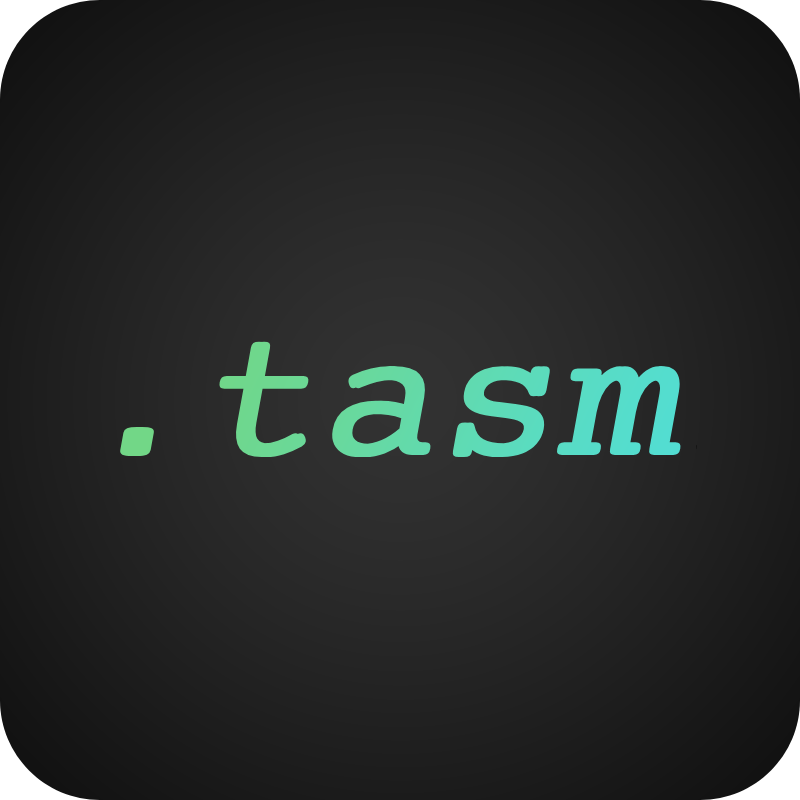

# .tasm 


A computational language that compiles to Geometry Dash trigger objects. Allows you to write complex trigger programs without actually placing triggers.
Not to be confused with the [Borland Turbo Assembler](https://en.wikipedia.org/wiki/Turbo_Assembler).  
  
TASM is currently in **version v0.3.0**.  
The working compiler is in the `rtasm/` directory. Note that the compiler is not a standalone executable, and must be executed from source.

Documentation can be found [here](https://tasm.mntpoint.org/docs/).  
Join the TASM community on Discord [here](https://discord.gg/spqKPeFvYf).

# Overview
TASM (Trigger Assembly) is a language with assembly-like syntax made specifically for working with the trigger system in Geometry Dash. The language's instruction set features many instructions that, when combined, allow for the creation of complex programs. 

> [!NOTE]
> Currently, the language is geared more towards traditional programming, which means that the instruction set is currently made mostly of arithmetic, control flow, and memory. There are plans to expand it in the future to a broader instruction set which covers more of the triggers available in the level editor.

Features:
* Turing-complete instruction set
* Optimised trigger placement and group usage
* Extensive documentation
* Built-in memory system
* Quick compilation to trigger objects
* Integration with dedicated backend: [GDlib](https://crates.io/crates/gdlib)
* Fast and versatile compiler

# Quick Start and Tutorial
## Quick Install
The TASM compiler (tasmc) now has an installer script for windows [here](https://tasm.mntpoint.org/install.ps1). This is a powershell script that must be ran from the command line.
## SDK Usage Instructions
To use the current up-to-date SDK, you may do the following:
1. Refer to the releases in this repo for pre-built executables
    ```bash
    # In the extracted folder with the compiler,
    .\tasmc <your_file>
    ```
2. Clone this repository and run from source.
    ```bash
    git clone https://github.com/ArrowSlashArrow/tasm-lang
    cd tasm-lang/rtasm
    cargo build --release
    .\target\release\tasm.exe <your_file>
    ``` 

Note that running from source requires Rust v1.88.0. 

## Which Windows build should I use?
- Use MSVC if you are unsure.
- Use GNU if you are not able to use MSVC.

## Useful compiler flags
Below is a list of commonly used compiler flags. This is not the full list of compiler flags, which can be accessed by running `tasmc --help`.
- `--gmd` / `-g`: Export to .gmd instead of writing directly to the savefile.
- `--release` / `-r`: Compile program with release mode optimizations enabled.
- `--level-name`: Sets the name of the exported level. Defaults to the name of the file.

## Tutorial
In this tutorial, we will create the fibonacci program. This program can be found at `example_programs/fib_in_memory.tasm`.
> [!NOTE]
> This program uses legacy memory. Dedicated memory instructions are deprecated as of v0.3.0, however they provide a simpler way to use dynamic addresses. Please refer to `stdlib/mem_8bit.tasm` for the current supported dynamic addressing component.

### Setup
To create a program, first make a `.tasm` file. For the sake of the tutorial, this file will be called `fib.tasm`.  
In the new file, create the entry point:
```tasm
_init:
    ; setup goes here

_start:
    ; entry point
```

### The program itself

We will write a program that produces the fibonacci sequence in memory.  
To do this, we must first allocate memory and set the first to terms of the sequence:
```
_init:
    LMALLOC 50       ; allocate 50 memory cells
    INITMEM 0, 1    ; set the first memory cell to 0 and the second to 1
```

The fibonacci sequence is generated by adding the previous two terms together and summing then to get the next. We will read the previous terms from memory, and deposit the next term after the sum has been computed.  
To do this, we will use four instructions to interact with memory:
* `LMREAD`: Set the memory mode to read mode.
* `LMWRITE`: Set the memory mode to write mode.
* `LMFUNC`: Interacts with the memory according to the mode. If it is read mode, read the value in the selected memory cell. Otherwise, if it is write mode, write a value to the selected memory cell.
* `LMPTR`: Moves the memory pointer. Starting location of the pointer is address 0.

First, we read the previous two numbers:
```
fib:
    LMREAD
    LMFUNC           ; read the first number
    LMOV C1, MEMREG  ; save it to C1
    LMPTR 1          ; go to next number
    LMFUNC           ; read
    ADD MEMREG, C1  ; add previous number to it
```

Then, we save the sum as the next number in the sequence:
```
    ; continue in routine fib
    LMWRITE
    LMPTR 1          ; increment pointer position
    LMFUNC           ; save the new number

    LMPTR -1         ; align pointer to last number
```

Finally, we spawn the routine from `_start` and again if we have more memory space.
```
    ; continue in routine fib
    ; spawn is pointer position is less than memsize - 1, which is set in _start
    SL fib, PTRPOS, C2

_start:
    ; set iteration limit so that the pointer does not escape the memory area
    MOV C2, MEMSIZE
    SUB C2, 1
    ; spawn the fibonacci loop
    SPAWN fib
```
### Compiling the program
If you are using the standalone exectuable, follow these steps:
1. Close Geometry Dash if it is open.
1. Navigate to the directory of the exectuable
2. Run `tasmc.exe fib.tasm`.
    - Note: If your tasm program is not in the same path as the executable, please use the actual path of the program.
    - Note 2: If you would like to export the program as a `.gmd` file instead of writing directly to the savefile, please supply the `--gmd` argument.
3. Open GD and verify that the program works.

Otherwise, if you are running the compiler from source, follow these steps:
1. Navigate to the `rtasm/` directory in the tasm repository.
2. Build the compiler by running `cargo build --release`. 
3. The executable compiler is now located at `target/release/tasmc.exe`
4. Run `.\target\release\tasmc.exe fib.tasm`
    - Note: If your tasm program is not in the same path as the executable, please use the actual path of the program.
    - Note 2: If you would like to export the program as a `.gmd` file instead of writing directly to the savefile, please supply the `--gmd` argument.
5. Open GD and verify that the program works.

> [!NOTE]
> If you are using tasmc on linux, the file will be called `tasmc` instead of `tasmc.exe`.
  
# Project Information
* TASM is not a mod. This project is intended to assist with creating trigger logic for GD levels. 
* The working compiler is located in the `rtasm` directory.
* There will not be an official higher-level language that compiles to TASM. That is not to say that creating such a language is discouraged though. If you like to, you are welcome to have a crack at it.
* Some valid TASM programs are in `example_programs`, `stdlib`, and `programs`. All of these programs are examples of valid TASM syntax. The `tests` directory is a collection of files used to test the compiler, however some are intentionally invalid. Files in `tests/` should not be taken as examples of good TASM code. 
* Old/deprecated files (such as the old pytasm compiler) are located in the `old` directory. Files there are considered deprecated and are not maintained. They should not be used to compile modern TASM.  
* Anyone is welcome to ask any questions on the [discord server](https://discord.gg/spqKPeFvYf). Any and all contributions are appreciated!